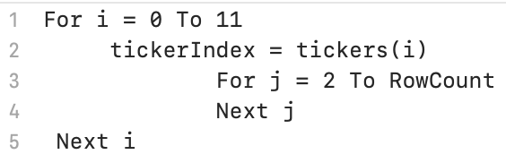
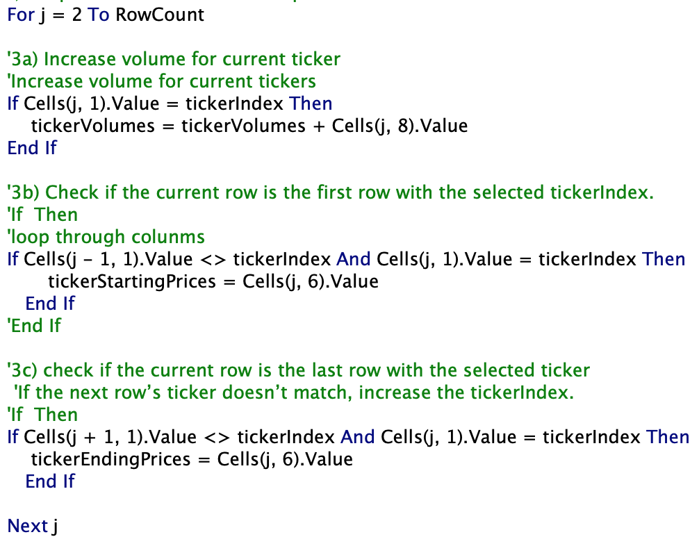
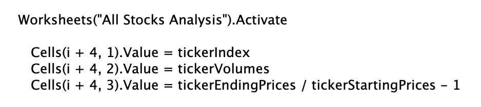
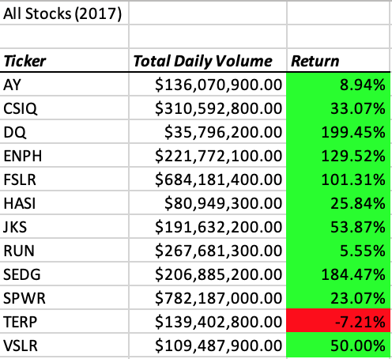
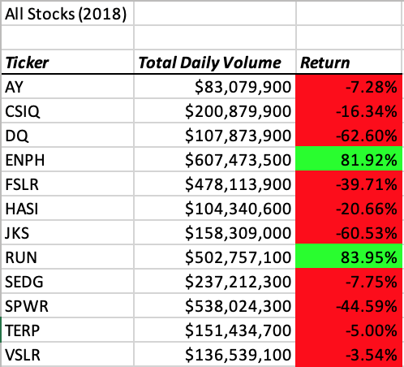

# Green-Stocks_analysis
Challenge 2 - Performing analysis on Green Stock data with VBA

## Overview of Project

In this project, a analysing of Green Stock data was provided using VBA.  By looping through the data of the Year of 2017 and 2018, total daily volume and return for each ticher was culculated.  After refactoring the code, the script is running more efficiently than before (After: 0.7109375 sec VS Before: 0.7421875 sec). To achieve the refactoring, unensessary steps were deleted, logic of the code structure was updated and functionalities was added.

## Results

### The Overview of Analysis

This analysis is based on the pre-analysis of the [green_stocks.xlsm](/green_stocks.xlsm) workbooks.  The code is working with high volume of stocks for the entire stock market.  Nested loops was created inside the code to ensure all data in selected spearsheets could be go through.  Button was re-assgin to new macro "AllStocksAnalysisRefactored".  By entering the target year, analysis of the entered year will analysed in worksheet "All Stocks Analysis". 

### Main Codes

* Nest Loop Structure: To record the formate of the nest loop
    

* Nest Loop Code: To determine how the data go through with nest loop in this analysis
    
    
* Output Setting Code: To define the output value and output location in the worksheet "All Stocks Analysis" 
    
    
More details could be found in [green_stocks.xlsm](/green_stocks.xlsm)

## Summary

As a result, total daily volume and return for 2017 and 2018 are shown as below:

- For the Year of 2017

For the year of 2017, most return for each tiches are positive, which means their is a increasing trend of stock price for this year, and the investors are with high posibility to earn from the stocks. Especially for the ticher DQ, the return was high to 199.45% for 2017 which is the best option of stock investing.

- For the Year of 2018

However, for the year of 2018, return on most tickers was negative, which means the stock value for each shares decreased and the investors who was invested in these tocks lost money from the shares. Only the investor holding ENPH and RUN won a positive income in the year of 2018.

To sum up, based on the result of 2017 and 2018 calculated in the worksheet "All Stockes Analysis", the stock market performed better in 2017.

- The advantages and disadvantages of refactoring code in general
  * Advantages: By refactoring the code, a clear structure will be created for analysing.  The period of the time to run a code would deducted by deducting unnessecary codes and increased efficiency using proper functions. High efficiency will occur when change formating for multipule worksheets which are required to use the same formates.
  * Disadvantages: It's hard to use the same worksheet to compare datas between each results with a same macro coding.
  
- the advantages and disadvantages of the original and refactored VBA script 
  * Advantages: Easy to customized with high flexibility with smaller structure of each macro. 
  * Disadvantages: Bugs are easier to occure bacause of logical decentralization between codes. The original script is harder to debug for the same reason.
  
